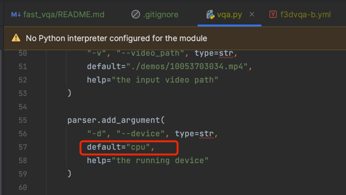
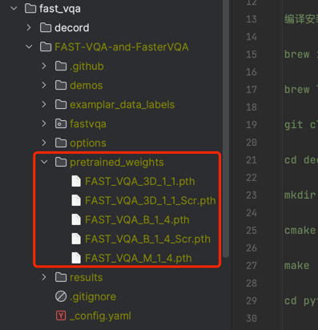

### 无参考衡量视频质量
源码：https://github.com/VQAssessment/FAST-VQA-and-FasterVQA

参考资料：
- https://hub.baai.ac.cn/view/20256
- https://link.springer.com/chapter/10.1007/978-3-031-20068-7_31
- https://www.ecva.net/papers/eccv_2022/papers_ECCV/papers/136660528.pdf

#### decord安装
```
源码：https://github.com/dmlc/decord

编译安装之前要保证本地的ffmpeg是4.X的，高版本decord无法编译成功

brew install cmake ffmpeg@4

brew link --overwrite ffmpeg@4

git clone --recursive https://github.com/dmlc/decord

cd decord

mkdir build && cd build

cmake .. -DCMAKE_BUILD_TYPE=Release

make

cd python

python setup.py install --user
```

#### python 基础库的安装
```
pip install scikit-video

pip install einops
```

#### 关掉GPU-CUDA


#### 机器学习模型
